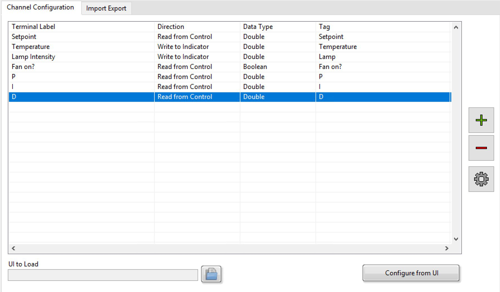
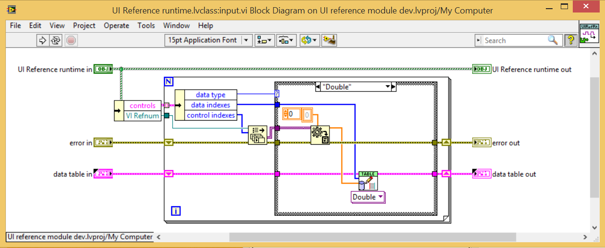

# Overview
Link DCAF items to a LabVIEW user interface.

# Description
Writes latest value to, and reads latest value from, a linked LabVIEW front panel running on the same target as the engine in which the module resides.

# Configuration of the UI Reference Module

### Steps before Configuration
- Build out the front panel that you wish to link to DCAF.  For a monitoring only UI, no block diagram code is needed, just the front panel items with correct labels and data types.
- The UI VI should be included in the build of the application, either statically by dropping it on the block diagram, or via the build specification settings.

### Configuration
Browse for the UI to Load, and select the user interface VI you wish to link to DCAF.

Click the Configure from UI button.  Select if you wish to generate tags based on the front panel items.  If you select Yes, tags will be made for all input and output items found on the front panel.  If you select no, the table will still be populated with all input and output items found, but you will need to manually map those items to tags.

If you wish to remove items from the table (for example, if there is a control you do not wish to expose to DCAF), select that line of the table and click the - button.

If you wish to add items to the table (for example, you just added a new control to the UI but you don't want to remap the whole UI), click the + button.  There must be an item with that label and data type present on the UI at run-time or you will get an error.

If you wish to modify an existing table item, press the gear button to configure that item, including the tag it is mapped to.

# Source Code Design

This module uses the most highly optimized method of reading/writing front panel items available, the Get/Set Control Values by Index functions.  These are much higher performance than using the VI Server Value or Value (Signalling) property nodes, since they do not need to perform any lookups into the front panel data space.

All items of a particular data type are read/written as a bulk operation.  For highest performance, use the minimum number of data types on the same panel (the overhead of 3 I32 writes is less than 1 I32 write, 1 U32 write, and one I16 write, for example).

The module resolves, during the init stage of run-time, the various named controls and indicators in the configuration to the specific control indices needed by the access functions.  The input runtime method then grabs the latest values of controls to read, and the output runtime method updates the values to write.

ui ref.png

To show the user interface at run-time, include the user interface VI at the top level of the DCAF application and make sure that the Show Front Panel When Called option is enabled.  This can be enabled either on the individual subVI call (right-click the subVI, select SubVI Node Setup... and enable the Show Front Panel When Called option) or for all calls to that subVI (go to VI Properties>>Window Appearance>>Customize and enable the Show Front Panel When Called option).

# Software Requirements
LabVIEW 2014 or later

# Limitations
- Requires each mapped control/indicator has a unique label.  Duplicate labels can cause issues when we look up the index of the control/indicator.  Note that you can give each control/indicator a unique label and have different displayed captions.
- Does not support cluster data types
- Does not support subpanels directly (a UI Reference Module for each running subpanel VI would need to be instantiated)
- Versions prior to 2.0.2.4 did not recurse through tab controls.  Please upgrade to a later version than 2.0.2.4 if you need this support
- Requires Embedded UI to be enabled for use on LinuxRT targets.  Lack of an enabled embedded UI will result in runtime errors.
- Latest value only - no event-based interface.  All values are read and written every time the engine iterates, regardless of whether they have changed or not.

# Installation

Install the UI Reference module directly from VI Package Manager.

# Support

Please report any issues with this module on our Github repository.

Visit Collaborating on the Development of DCAF to learn how to contribute your own improvements to this module directly.
